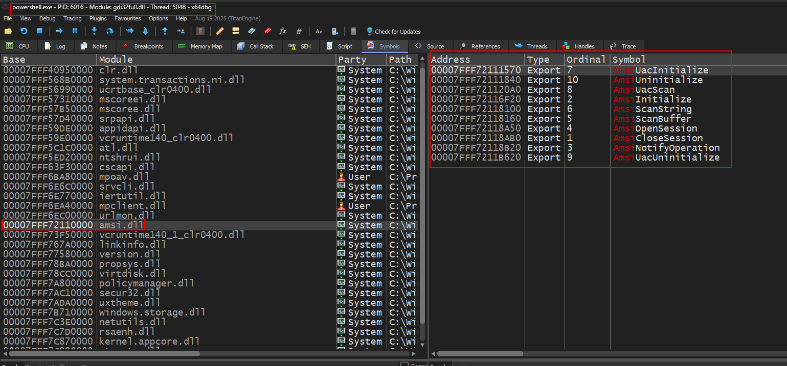
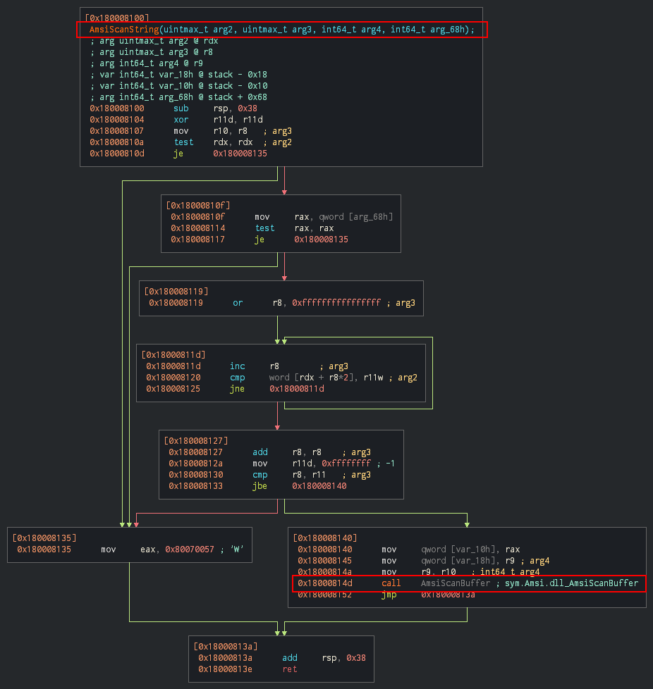

import Callout from '@/components/Callout.astro'

 Now that we have a basic understanding of AMSI, let's jump into how AMSI actually does this under the hood.

When a [PowerShell](https://en.wikipedia.org/wiki/PowerShell) process is instantiated, the Windows loader automatically loads numerous Dynamic Link Libraries (DLLs) into the process address space. Amongst these DLLs one is the `amsi.dll` as shown in the image below.
  

The `amsi.dll` library exposes several Win32 APIs. Relevant information captured by these APIs is forwarded to the registered anti-malware provider through an interprocess communication mechanism called [Remote Procedure Call](https://learn.microsoft.com/en-us/windows/win32/rpc/rpc-start-page). After the anti-malware provider analyzes the data, the result is sent back to amsi.dll inside the PowerShell process. Note that while Windows Defender is the default provider on Windows systems, any anti-malware vendor can register as an AMSI provider.

There are four core functions that are used...

 ### AmsiInitialize
 When PowerShell is launched, it loads `amsi.dll` and calls `AmsiInitialize(){:js}`. Thus, `AmsiInitialize(){:js}` is called even before you Invoke any command and hence it can't be manipulated. There are two inputs to this function, one is the name of application (for example, powershell) and another one is amsicontext structure which is used by the subsequent calls.

 ```c++
 HRESULT AmsiInitialize(
  [in]  LPCWSTR      appName,
  [out] HAMSICONTEXT *a

 ```


 ### AmsiOpenSession
 `AmsiOpenSession(){:js}` accepts the amsiContext  structure and creates a session structure to be used in all calls within that session. 

 ```cpp
 HRESULT AmsiOpenSession(
  [in]  HAMSICONTEXT amsiContext,
  [out] HAMSISESSION *amsiSession
);
```
 
 
 
 ### AmsiScanString
 
 `AmsiScanString(){:js}` is a function within `AmsiScanBuffer(){:js}` and calls it ultimately. Below is a image showing disassmbled graph of `AmsiScanString(){:js}` function.



```cpp
 HRESULT AmsiScanString(
  [in]           HAMSICONTEXT amsiContext,
  [in]           LPCWSTR      string,
  [in]           LPCWSTR      contentName,
  [in, optional] HAMSISESSION amsiSession,
  [out]          AMSI_RESULT  *result
);
```

### AmsiScanBuffer
 `AmsiScanBuffer(){:js}` is the core scanning function that accepts a buffer containing the string/script to be scanned and sends it to the registered anti-malware provider. It returns two values.
- **HRESULT**:  `S_OK{:tsx}` if the API call is successful and if not and if not it returns an **HRESULT** error code. [Microsoft documentation](https://learn.microsoft.com/en-us/shows/inside/hresult) shows a various errors and their respective codes. `E_INVALIDARG` (`0x80070057`), indicating one or more arguments are not valid, is one of the important error codes.
----------
### AMSI_RESULT

```cpp
HRESULT AmsiScanBuffer(
  [in]           HAMSICONTEXT amsiContext,
  [in]           PVOID        buffer,
  [in]           ULONG        length,
  [in]           LPCWSTR      contentName,
  [in, optional] HAMSISESSION amsiSession,
  [out]          AMSI_RESULT  *result
);
```

As mentioned earlier, `AmsiScanBuffer(){:js}` returns an **AMSI_RESULT** value through its output parameter. The most important results are:
- **AMSI_RESULT_CLEAN**: Content is not malicious, execution can proceed
- **AMSI_RESULT_DETECTED**: Malware detected, content should be blocked

Based on the **AMSI_RESULT** returned, the calling application  decides whether to continue or stop execution.

```cpp
typedef enum AMSI_RESULT {
  AMSI_RESULT_CLEAN,
  AMSI_RESULT_NOT_DETECTED,
  AMSI_RESULT_BLOCKED_BY_ADMIN_START,
  AMSI_RESULT_BLOCKED_BY_ADMIN_END,
  AMSI_RESULT_DETECTED
} ;
```

<Callout title="TLDR;" variant="summary">

When an application attempts to submit content to be scanned by a vendor agent (referred to as an AMSI provider), the application loads `amsi.dll` and calls its <abbr title="AmsiOpenSession">AmsiInitialize</abbr> and <abbr title="AmsiOpenSession">AmsiOpenSession</abbr> functions in order to establish an AMSI session. The content to be scanned is then submitted via the AmsiScanString or AmsiScanBuffer functions

On the receiving end of the content, a vendor’s AMSI provider DLL receives and makes a determination about the content. Vendors can have more than one AMSI provider formally registered in the `HKEY_LOCAL_MACHINE\SOFTWARE\Microsoft\AMSI\Providers` registry key using their associated [COM](https://learn.microsoft.com/en-us/windows/win32/com/component-object-model--com--portal) GUID values. When the provider DLL makes a decision on the content, it passes on its decision to the original application with an **AMSI_RESULT** enum value. If the return value is **AMSI_RESULT_DETECTED** and the underlying scanning engine hasn’t already performed a preventative action, it is up to the submitting application to decide what it wants to do with the content that was classified as malicious.
</Callout>