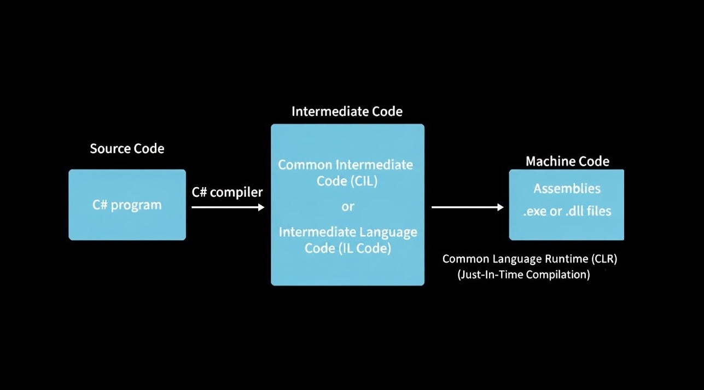
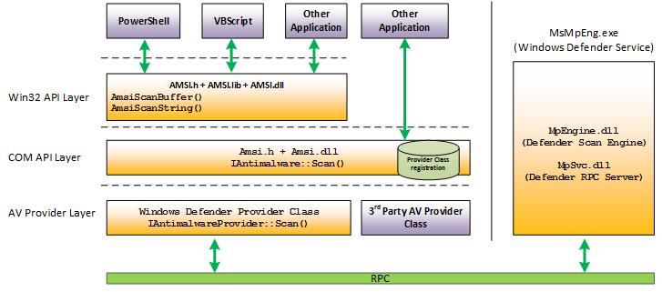

import Callout from '@/components/Callout.astro'
import FirstSubpost from '@/components/FirstSubpost.astro'


PowerShell was introduced by Microsoft to help administrators automate work using scripts. The antivirus/antimalware solutions of that time monitored disk files continuously for any malicious ones.
But with the introduction of PowerShell, the cat and mouse game got complicated for these solutions. Attackers found a way to download malicious scripts and load them directly into memory without touching the disk.


<Callout title="PowerShell: Retrieve and Manage Data" variant="example">
```powershell 
# Downloads the file to disk
(New-Object System.Net.WebClient).DownloadFile()
# Injects the content directly into memory
(New-Object System.Net.WebClient).DownloadString()
```
</Callout>

So C2 frameworks like PowerShell Empire happily exploited this and loaded PowerShell or `.ps1` scripts into memory. This was the point when AMSI was introduced. AMSI is basically a scanning middleman <svg xmlns="http://www.w3.org/2000/svg" width="24" height="24" viewBox="0 0 24 24" fill="none" stroke="currentColor" stroke-width="2" stroke-linecap="round" stroke-linejoin="round" class="lucide lucide-person-standing-icon lucide-person-standing" style="display: inline-block; vertical-align: middle;"><circle cx="12" cy="5" r="1"/><path d="m9 20 3-6 3 6"/><path d="m6 8 6 2 6-2"/><path d="M12 10v4"/></svg> i.e. when PowerShell or any scripting engine wants to check if something is malicious, it calls AMSI functions like `AmsiScanBuffer(){:js}` or `AmsiScanString(){:js}`, passing the script content. AMSI then forwards this to whatever antivirus product is registered on the system (Windows Defender, Kaspersky, etc.).

Then attackers realized they could bypass this using C#. They could load compiled C# assembly bytes directly into memory using `Assembly.Load(){:js}`. These assemblies are pre-compiled to [Common Intermediate Language](https://www.codeproject.com/articles/Understanding-Common-Intermediate-Language-CIL#comments-section), and when executed, the [CLR](https://learn.microsoft.com/en-us/dotnet/standard/clr)'s [JIT](https://kipp.ly/jits-intro/) compiler converts them to native machine code on-the-fly in memory, completely bypassing AMSI's script scanning since AMSI back then didn't hook into the CLR.



# What is AMSI?????? 
The Antimalware Scan Interface (AMSI) was first introduced by [Microsoft](https://learn.microsoft.com/en-us/windows/win32/amsi/antimalware-scan-interface-portal) in 2015, to improve the detection of malicious script before executing it. As mentioned earlier, AMSI acts as an intermediary/middleman that submits scripts, commands, and memory buffers to registered AV engines for inspection prior to execution.  The AV engine returns a scan result (e.g., **AMSI_RESULT_CLEAN**, **AMSI_RESULT_DETECTED**), and AMSI enforces the decision by either allowing execution or blocking it and returning an error to the calling application.

It is integrated into components like UAC, Office Macros, PowerShell, and Windows Script Host (`wscript.exe` and `cscript.exe`) 



Below, I am attempting to run the `invoke-mimikatz` command in PowerShell terminal. 

```powershell showLineNumbers startLineNumber=001 ins={1,9} {5-7,11-14} collapse={15-17,26-29}
PS C:\WINDOWS\System32> invoke-mimikatz
At line:1 char:1
+ invoke-mimikatz
+ ~~~~~~~~~~~~~~~
This script contains malicious content and has been blocked by your antivirus software.
    + CategoryInfo          : ParserError: (:) [], ParentContainsErrorRecordException
    + FullyQualifiedErrorId : ScriptContainedMaliciousContent

PS C:\WINDOWS\System32> Get-WinEvent -LogName 'Microsoft-Windows-Windows Defender/Operational' | Where-Object Id -eq 1116 | Format-List

TimeCreated  : 17/11/2025 17:51:02
ProviderName : Microsoft-Windows-Windows Defender
Id           : 1116
Message      : Microsoft Defender Antivirus has detected malware or other potentially unwanted software.
                For more information please see the following:
               https://go.microsoft.com/fwlink/?linkid=37020&name=Trojan:PowerShell/PSAttackTool.A&threatid=2147729106&
               enterprise=0
                        Name: Trojan:PowerShell/PSAttackTool.A
                        ID: 2147729106
                        Severity: Severe
                        Category: Trojan
                        Path: amsi:_\Device\HarddiskVolume3\Windows\System32\WindowsPowerShell\v1.0\powershell.exe
                        Detection Origin: Unknown
                        Detection Type: Concrete
                        Detection Source: AMSI
                        User: <SNIP>
                        Process Name: C:\Windows\System32\WindowsPowerShell\v1.0\powershell.exe
                        Security intelligence Version: AV: 1.441.290.0, AS: 1.441.290.0, NIS: 1.441.290.0
                        Engine Version: AM: 1.1.25100.9002, NIS: 1.1.25100.9002
```


As seen, we receive the error message <kbd>This script contains malicious content and has been blocked by your antivirus software</kbd>. When we investigate what actually blocked this execution by filtering Windows Defender events using `Event ID 1116` (which is triggered when Microsoft Defender Antivirus detects malware or other potentially unwanted software), we can see that Microsoft Defender made the decision to block it based on AMSI's scan submission.

In the next Subpost, we'll delve deeper into the inner workings of AMSI and explore how a simple `Invoke-Command` can trigger AMSI's scanning mechanis


 


<FirstSubpost title="Part 1: Core AMSI APIs" href="/blog/amsi/core-api" />


