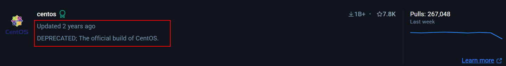

import Callout from '@/components/Callout.astro'

This blog is part of my best practices for deploying an application in a containerized environment, taking into consideration the various security measures that have been implemented for seamless integration. I might further explain the impact of [Ansible playbooks](https://docs.ansible.com/ansible/latest/playbook_guide/playbooks_intro.html) used for automation of deployment of containers.  


## Docker Introduction

> Docker is used to package and [containerized](https://www.docker.com/resources/what-container/) applications and ship them and to run them anywhere, anytime and any number of times.

- Let me explain the usage of Docker with an example. Most of us have faced the `ModuleNotFoundError{:bash}` error because of missing Python packages or libraries. This is when Docker comes into play, providing an environment with all these dependencies installed. One could simply find an image on Docker Hub, which includes a Linux machine with all the required Python dependencies, ensuring that the application runs consistently across different systems solving the `"it works on my machine problem"`.
- Now that we understand the usage of docker, we need to understand how docker works.

## How Docker works?

- An operating system is just the kernel plus the essential software layered over hardware.
- Let’s take different Linux distros, such as Ubuntu (based on Debian) and Red Hat. While these may have different software and packages, they all use the same kernel. Distros are like humans: they may vary a lot on the outside but contain the same kernel inside (like human body parts).
- Docker essentially uses this concept, using the kernel of the host system and installs multiple containers or instances over it. With Docker, one can have a single Linux host and install multiple Linux containers or instances over it.

<Callout variant="important">
Now that we understand Docker uses the kernel of the host system, it’s important to note that Linux containers cannot be directly installed on a Windows machine or vice-versa. This is because the kernel in a Windows system is different from the Linux kernel. 
  <Callout>
    Docker relies on the underlying host's kernel to run containers, and since the Windows kernel is not compatible with Linux-specific system calls and functionalities, you cannot run Linux containers natively on Windows. However, there are workarounds, such as using `Windows Subsystem for Linux (WSL)` to enable the running of Linux containers on a Windows host
  </Callout>
</Callout>

 The following are some basic components of Docker:
- **`Images`**: Executable code built in layers. A read only template or recipe for a container and can't be modified.
- **`Containers`**: Containers are created from images and are isolated from each others. These are the environments we run, but they can be started/stopped.
- **`Docker Daemon`**: It does all the real work behind containers, from building to running and delivery.
- **`Docker Client`**: The component you use to issue instructions, such as the Docker CLI.
- **`Docker Hub`**: A repository of Docker images. 

### Dockerfile and Docker Compose

A [Dockerfile](https://docs.docker.com/reference/dockerfile/) a script that basically automates the creation of a Docker image using multiple instructions, which in turn is reponsible for creating containers. One such instruction is called the `ENTRYPOINT` which specifies the commands that will always run whenever a new container is created. The below shows a simple `Dockerfile` that runs an `entrypoint.sh` script.

```bash title="Dockerfile" showLineNumbers startLineNumber=001 {"Interesting code":6-13}
FROM ubuntu:22.04

ENV MY_ENV_VAR="Hello, World!"

RUN apt-get update && apt-get install -y bash

COPY entrypoint.sh /entrypoint.sh

# Make the entrypoint script executable
RUN chmod +x /entrypoint.sh

# Set the entrypoint to execute the script
ENTRYPOINT ["/entrypoint.sh"]
```

```bash title="entrypoint.sh"
#!/bin/bash

# Print the environment variable and a hello message
echo "My environment variable is: $MY_ENV_VAR"
echo "Hello, World!"
```
In the above case basically the Dockerfile uses the Ubuntu image and install bash shell to run commands and copies the `entrypoint.sh` to every container that is created, basically setting it as an entrypoint. In our case, the script prints the environment variable inside the container and displays the message "Hello World!".


[Docker Compose](https://docs.docker.com/compose/) is a tool that helps you easily set up and run apps that use more than one container. It lets you define everything your app needs in one file and start it all with a single command, making development and deployment much simpler.


```bash title="Some basic docker-compose commands"
# Start all services defined in docker-compose.yml
docker-compose up

# Start services in the background (detached mode)
docker-compose up -d

# Stop all running containers
docker-compose down

# View logs of your containers
docker-compose logs

# Check running services
docker-compose ps
```

### Example: Why You Need Docker Compose in Real Life
Imagine you're building a web app that needs:
- A frontend (like `React` or `HTML/CSS`)
- A backend (like a `Flask` or `Node.js` server)
- A database (like `MySQL` or `MongoDB`)

Instead of starting each one manually with separate `docker run` commands, you can define them all in a `docker-compose.yml` file like so:

```yaml title="Sample docker-compose.yaml"

version: '3'
services:
  web:
    build: ./web
    ports:
      - "3000:3000"
  backend:
    build: ./backend
    ports:
      - "5000:5000"
    depends_on:
      - db
  db:
    image: mysql:5.7
    environment:
      MYSQL_ROOT_PASSWORD: password
```

Then you can just run 

```bash 
docker-compose up 

```

All the services will be up and talking to each other. 
> **Note:** Docker networking allows containers to communicate with each other, the host system, and external networks.  


## Background

Back the case study where we were provided a vulnerable `CentOS version 7` Docker image, which was deprecated in 2022, was initially used to host a web application powered by an Nginx-based web server. The CentOS container also hosted the application logic, while a separate MariaDB container acted as the database server. The end goal being industry-grade container hardening of the containers NOT THE APPLICATION RUNNING ON IT.

Firstly, due to CentOS's deprecation, the infrastructure was transitioned to a more current and supported `Ubuntu` base image, version `22.04.3 LTS "Jammy Jellyfish"`.



The following changes had to be made in the configuration files of the application also bolstering the overall posture:
- Replacing `nginx` user with the `www-data` user.
- Updating the process manager to `php8.1-fpm` handle web requests for PHP application.
- Remapping the default port of the web application to  `8081` from `80`.

Further the container provided wasn't [persistent](https://en.wikipedia.org/wiki/Persistence_(computer_science)) which impact **2** of the **3**  [CIA triads ](https://www.geeksforgeeks.org/the-cia-triad-in-cryptography/)(Integrity and Availability)

The below was my implementation to establish persistence using Ansible for automation:

```yml title="playbooks⠀›⠀dbstack.yml"  collapse={8-17} collapse={31-38}
---
- name: Automate Docker tasks and manage MariaDB user passwords with Ansible
  hosts: localhost
  vars_files:
    - secrets.yml  # Include a variable file that contains 'db_password'

  tasks:
    - name: Start Docker containers
      community.docker.docker_compose:  # Uses the docker_compose module to manage Docker services
        project_src: /root/Desktop/pma  # The location of the docker-compose project files
        state: present  # Ensures that the containers are running
        build: yes  # Builds the images before starting if necessary

    - name: Wait for the database container to start
      pause:  # Pause the execution of the playbook for a set number of seconds
        seconds: 10  # The duration of the pause to allow the database container to fully start

    - name: Check if 'suggestion' table exists
      community.docker.docker_container_exec:  # Executes a command inside a running container
        container: u5579496_csvs_dbserver_c  # The name of the container to execute the command in
        command: "mysql -uroot -p\"{{ db_password }}\" -e \"USE csvs23db; SHOW TABLES LIKE 'suggestion';\""  # Command to check if the 'suggestion' table exists in the database
      register: check_table  # Store the output of this task in the variable 'check_table' for conditional checks later

    - name: Execute SQL script if 'suggestion' table does not exist
      community.docker.docker_container_exec:  # Executes a command inside a running container
        container: u5579496_csvs_dbserver_c  # The name of the container to execute the command in
        command: "mysql -uroot -p\"{{ db_password }}\" csvs23db"  # Command to execute SQL statements in the database
        stdin: "{{ lookup('file', '../dbserver/sqlconfig/csvs23db.sql') }}"  # Read SQL commands from the specified file and pass it to the stdin of the command
      when: "'suggestion' not in check_table.stdout"  # Condition to only run this task if the 'suggestion' table does not exist

    - name: Ensure 'root' user's password is set correctly in MariaDB
      mysql_user:  # Uses the mysql_user module to manage MySQL user accounts
        login_user: root  # The user to log in as
        login_password: "{{ db_password }}"  # The password for the user to log in with
        name: root  # The name of the user to manage
        password: "{{ db_password }}"  # The desired password for the 'root' user
        host_all: yes  # Apply password change for 'root' user across all hosts
      when: "'suggestion' in check_table.stdout or 'suggestion' not in check_table.stdout"  # This condition is redundant as it always evaluates to true; hence this task always runs
```

[Ansible playbooks](https://docs.ansible.com/ansible/latest/playbook_guide/playbooks.html) allow sets of tasks to be scripted so they can be run routinely at points in time. This is useful for combining various setup tasks, such as adding user accounts and settings to a new server or updating large numbers of machines at once. We'll be focussing on controlling Node actions via Ansible Playbooks. Keep in mind this can also be done using [ad-hoc](https://docs.ansible.com/ansible/latest/user_guide/intro_adhoc.html) commands but they only offer a situation where we would want to run a command on multiple servers.

> Although it is quite common to run playbooks with elevated privileges, it is not always necessary. Security-aware administrators will set up dedicated users for 
Ansible tasks and limit their access to only what they need.

Playbooks are written using the [YAML](https://docs.ansible.com/ansible/latest/reference_appendices/YAMLSyntax.html#yaml-syntax) markup language. Although, I'm aware that this itself can expand threat landscape for attackers as there are ways to harvest credentials from the [ansible-vault](https://docs.ansible.com/ansible/latest/cli/ansible-vault.html) using [John](https://www.openwall.com/john/).

## Securing the Docker Image and Containers


Following the defense-in-depth principle. The layers being during build, pre-production, and runtime process.
1. Setting the `DOCKER_CONTENT_TRUST=1{:bash}` ensures docker images and their signatures are verified before use.
2. Specifying specific tag like `mariadb:10{:bash}` and `ubuntu:22.04{:bash}` in the Dockerfile to avoid unexpected changes.
3. Configuring the container networks which are by default binded to all the network interfaces.
4. Stripping excessive [container capabilities](https://dockerlabs.collabnix.com/advanced/security/capabilities/), which are unnecessary for the basic functionality of the application, becomes apparent when initiating a child process within an independent namespace, as the current session lacks assigned capabilities.
5. In a Linux docker container, a process can communicate with another process by allocating them a shared memory space. Basically, the container shouldn’t be able to access one another’s memory and should given their own IPC namespaces.
6. Secure computing mode (`seccomp`) is used to disable actions within a container. The [default seccomp](https://github.com/moby/moby/blob/master/profiles/seccomp/default.json) profile disables around 44 syscalls.
7. [AppArmor](https://docs.docker.com/engine/security/apparmor/) consists of Linux security modules that can implement `Mandatory Access Controls` and `Discretionary Access Controls`. However, the permissions and use cases for each of these differ due to the base images, we could only implement it extensively on the webserver due to the write-operations database server performs on Linux file systems.
8. [Control groups](https://docs.docker.com/engine/containers/runmetrics/#control-groups) (`cgroup`) limit the resources that have been allocated to a particular container. From a security perspective, it ensures that one process doesn’t hog up the resources of another process impacting the behaviour. By default, a process inherits the `cgroups` of its parents. Hence, we tasked the Linux kernel to allocate certain `cgroups` from the `pseudo-filesystems` in our hosts. The setting in our case allocates `memory limit{:bash}`, `memory reservation{:bash}`, `CPU resources{:bash}` and `Process IDs{:bash}` to the containers.

To improve overall system security and operational monitoring, I implemented some additional measures:
- [Fluentd](https://www.fluentd.org/) for logging and monitoring, as security incidents can only be effectively tracked with proper audit trails. By default, Docker containers log only the STDOUT/STDERR, which is limited for comprehensive monitoring.
- **Registry Analysis from Container Blobs:** Adversaries can extract sensitive information, such as passwords, by analyzing container images and registry blobs. Storing passwords in Dockerfile layers is unsafe, as they can be easily retrieved.

## Scanning and Auditing Containers

Writing audit rules and test cases can vary depending on the usecase for the containers and can be included in the `audit files` located in `/etc/audit` directory.  These audit rules help track events related to container activity, providing insights into potential security vulnerabilities and breaches. Further, open-source tools like docker-bench-security, Trivy, and Lynis can be used to assess container security.

- [docker-bench-security](https://github.com/docker/docker-bench-security) evaluates Docker containers against security best practices, highlighting misconfigurations and vulnerabilities.

- [Trivy](https://trivy.dev/) is a simple yet comprehensive vulnerability scanner for containers, scanning both images and dependencies for known vulnerabilities.

- [Lynis](https://github.com/CISOfy/lynis) is a security auditing tool that can audit not only containers but also the entire system, ensuring the host and container security practices are up to standard.

These tools, combined with regular audits, ensure that a secure cloud infrastructure starts with secure containers.

I understand that I might've created 10 problems to solve one, but one thing is clear that I can build, configure and harden my own Docker containers.